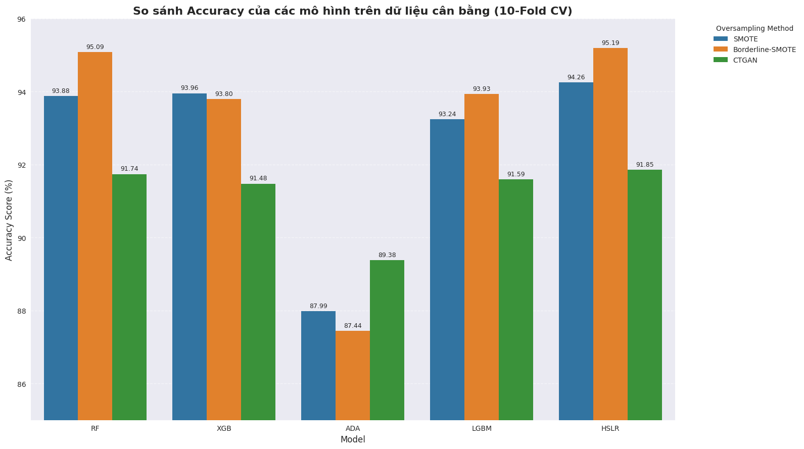

# Customer Churn Prediction 🚀

This repository contains a comprehensive machine learning pipeline for predicting customer churn in marketing campaigns. Originally developed as a Business Data Analysis course project, the codebase has been extensively refactored from a sequential Jupyter Notebook into a robust, object-oriented Python package.

The core objective of this project is to accurately identify customers at risk of churning by exploring multiple data balancing techniques and training advanced ensemble models.

## 🎯 Key Highlights

- **Extensive Data Preprocessing**: Custom feature engineering (`Age`, `Tenure_days`, `Total_Spend`), intelligent imputation (e.g., group-based median imputation for Income), and dynamic grouping for rare categorical variables.
- **Handling Imbalanced Data**: We systematically evaluated three distinct data balancing methods: **SMOTE**, **Borderline-SMOTE**, and **CTGAN** (Conditional Tabular GAN).
- **Hybrid Ensemble Modeling**: We built multiple advanced base learners (Random Forest, XGBoost, AdaBoost, LightGBM) and unified them using a **Hybrid Stacking Logistic Regression (HSLR)** model.
- **Rigorous Evaluation**: The pipeline evaluates models using Independent Test Sets, 5-Fold, and **10-Fold Cross-Validation** to ensure robust and unbiased performance metrics.

---

## 🏆 Optimal Approach & Results

After extensive experimentation, the combination of **Borderline-SMOTE** (for oversampling minority classes near decision boundaries) and the **HSLR (Hybrid Stacking Logistic Regression)** meta-learner yielded the absolute best results. 

Borderline-SMOTE effectively handled the severe class imbalance without introducing noise, providing high-quality synthetic data for our Stacking ensemble. The final HSLR model achieved an impressive **Accuracy of ~95.2%**, significantly outperforming baseline models and other balancing methods (like standard SMOTE and CTGAN).

### Key Visualizations


*Figure 1: Accuracy comparison across models and the 3 balancing methods. Notice how Borderline-SMOTE (combined with HSLR) dominates the chart.*

---

## 📂 Project Structure

```
customer-churn-prediction/
├── data/               # Contains the dataset (marketing_campaign.csv)
├── docs/               # Documentation
├── notebooks/          # Original Jupyter notebooks from the university project
├── results/            # Extracted charts, plots, and evaluation metrics
├── src/                # Core Python package
│   ├── data_loader.py  # Script for loading data safely
│   ├── preprocessing.py# Data cleaning, feature engineering & balancing
│   ├── model.py        # Model initialization, base learners & HSLR ensemble
│   ├── utils.py        # Evaluation, K-Fold CV, and visualization utilities
│   └── __init__.py     
├── main.py             # Main entry point to run the ML pipeline
├── requirements.txt    # Python dependencies
└── README.md           # This documentation
```

## ⚙️ Setup & Installation

1. **Clone the repository:**
   ```bash
   git clone https://github.com/viethoangp/hybrid-churn-predictor.git
   cd customer-churn-prediction
   ```

2. **Create a virtual environment (optional but recommended):**
   ```bash
   python -m venv venv
   source venv/bin/activate  # On Windows use `venv\Scripts\activate`
   ```

3. **Install dependencies:**
   ```bash
   pip install -r requirements.txt
   ```

4. **Add Dataset:**
   Ensure `marketing_campaign.csv` is placed inside the `data/` folder before running the pipeline.

## 🚀 Usage

To run the complete machine learning pipeline, execute the `main.py` script:

```bash
python main.py
```

This will automatically:
1. Load and clean the dataset.
2. Apply **Borderline-SMOTE** balancing.
3. Train Random Forest, XGBoost, LightGBM, AdaBoost, and **HSLR**.
4. Evaluate and print Accuracy, Precision, Recall, F1, MCC, and ROC-AUC scores.

## 📦 Requirements
- Python 3.8+
- Scikit-learn, Imbalanced-learn
- XGBoost, LightGBM
- Pandas, NumPy, Matplotlib, Seaborn
